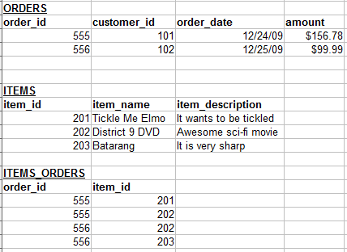
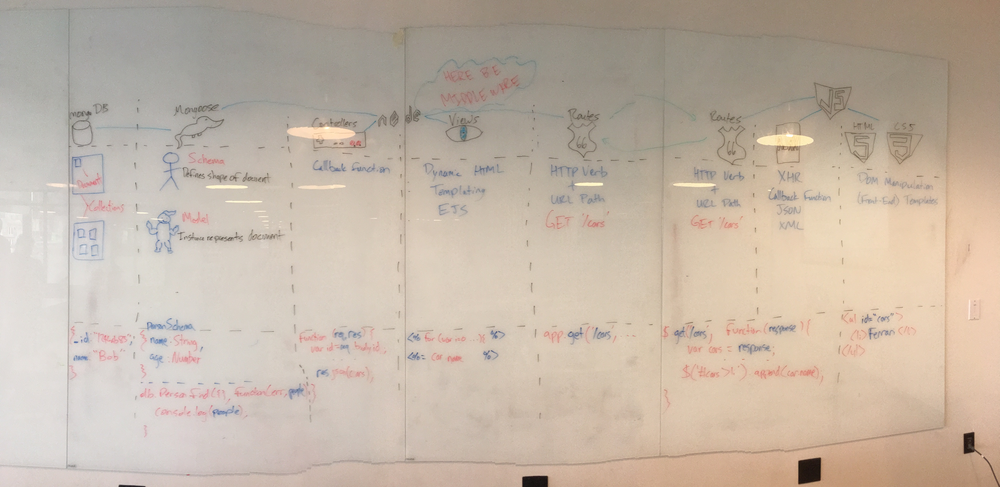

# Unit 3 Week 2 Second Pass

## Angular

### Common Angular Errors and Debugging Tips

https://medium.com/@jonsamp/angularjs-finding-and-fixing-errors-dcd648329fe9#.hgnagwsch

### ng-repeat Documentation

- [W3Schools](http://www.w3schools.com/angular/ng_ng-repeat.asp)
- [AngularJS Doc](https://docs.angularjs.org/api/ng/directive/ngRepeat)

## SQL

### Many-to-Many in SQL and Sequelize

- SQL

- [Sequelize](http://docs.sequelizejs.com/en/latest/docs/associations/#belongs-to-many-associations)

## Conclusion

Remember this guy?

There are only two major differences between our stack for Project 2 and 3.

1. Angular
  - We now tie all of our JS and HTML together with the Angular framework.
2. SQL
  - Instead of Mongoose and Mongo, we now use Sequelize and PostgreSQL to save our data.

Everything else is the same.
